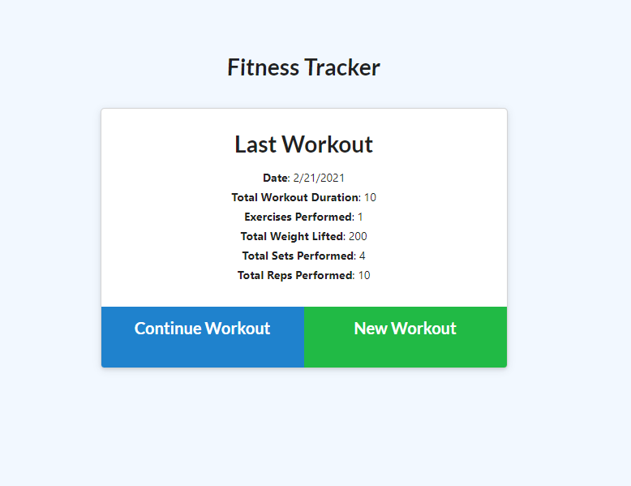

# Exercise Tracker

## Description
This is an application to store workout routines for each day. It allows you to add specific exercises to a workout and will aggregate data from your most recent workouts and display stats for them on the Dashboard page.

## Built With

* [HTML](https://developer.mozilla.org/en-US/docs/Web/HTML)
* [CSS](https://developer.mozilla.org/en-US/docs/Web/CSS)
* [JS](https://www.javascript.com/)
* [GitHub](https://github.com/)
* [Git](https://git-scm.com/)
* [node.js](https://nodejs.org/en/)
* [npm](https://www.npmjs.com/)
* [express](https://www.npmjs.com/package/express)
* [Heroku](https://dashboard.heroku.com/)
* [MongoDB](https://www.mongodb.com/)
* [MongoDB Atlas](https://www.mongodb.com/cloud/atlas/)

## Deployed Link

* [See Live Site](https://desolate-anchorage-72330.herokuapp.com/)

## Preview of Working Site



## Code Snippet
This code shows the api routes used to retrieve and send data to and from the database. This snippet was chosen because for this application I only did the backend of the application and the api routes that connect the application to the database are the most important elements of it.

```javascript
    app.get("/api/workouts", function (req, res) {


        db.aggregate([
            {
                $addFields: {
                    totalDuration: { $sum: "$exercises.duration" }
                }
            }
        ]).then(function (error, data) {
            if (error) {
                res.send(error);
            } else {
                res.json(data);
            }
        });
    });

    app.post("/api/workouts", function (req, res) {
        db.create({}, function (error, data) {
            if (error) {
                res.send(error);
            } else {
                res.json(data);
            }
        })
    });

    app.put("/api/workouts/:id", function (req, res) {
        db.findOneAndUpdate({ _id: req.params.id }, { $push: { exercises: req.body } }, function (error, data) {
            if (error) {
                res.send(error);
            } else {
                res.json(data);
            }
        });
    });

    app.get("/api/workouts/range", function (req, res) {
        db.aggregate([
            {
                $addFields: {
                    totalDuration: { $sum: "$exercises.duration" }
                }
            }
        ]).limit(7).then(function (error, data) {
            if (error) {
                res.send(error);
            } else {
                res.json(data);
            }
        });
    });
```

## Authors

* **Raffi Lepejian** 

## Contact Information

- [Link to Portfolio Site](https://rslepejian.github.io/portfolio/)
- [Link to Github](https://github.com/rslepejian)
- [Link to LinkedIn](https://linkedin.com/in/raffi-lepejian-071876153)